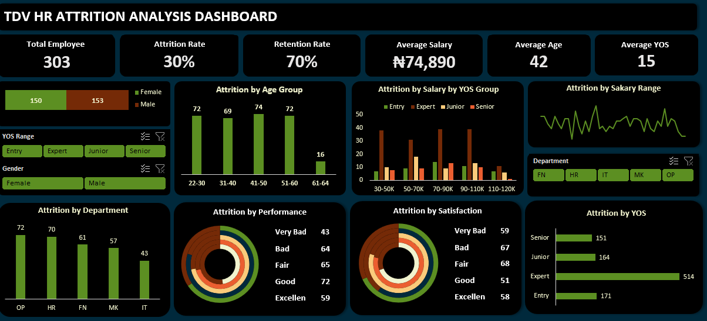

<!--Section 1: Introduce your self-->
## ABOUT ME

Hello! I'm Ayobami Oje 🤓, a data analyst, educator, and engineer and consultant with a passion for turning data into actionable insights. With experience across sales, operations, finance, and customer service, I help businesses solve challenges and unlock growth.

<!--Mention your top/relevant skills here - core and soft skills-->
## WHAT I DO

*As the Chief Analyst of the_DataVersewithAY, I provide consulting and training services for businesses and mentor aspiring analysts.*

**- ✅ Data Analytics Consulting.**
I provide in-depth analysis and tailored solutions to help you make data-driven decisions, optimize processes, and drive business growth. 

**- ✅ Staff Training & Development.**
I offer comprehensive training programs in data analysis, visualization, and data-driven decision-making. From beginner to advanced levels. 

<!--Section 2: List 3-4 key projects-->
## MY PORTFOLIO 

*A glimpse of some of the projects I've been working on.*

**Sales data analysis of for blinkit stores.**

blinkit stores is a buisness venture with many supermarket and groceries outlets.

[Read More](https://www.linkedin.com/pulse/predictive-modeling-hypothesis-testing-using-titanic-dataset-anietie/)

**The Movie Database (TMDB) Analysis .**

This is a movie analysis of The Movie Database. 

[Read More](https://www.linkedin.com/pulse/predictive-modeling-hypothesis-testing-using-titanic-de/)

**The Healthcare Data Analysis .**

This is a healthcare analysis of the 3MTT cohort2 capstone project. 

[Read More](https://www.linkedin.com/pulse/predictive-modeling-hypothesis-testing-using-titanic-de/)

**HR attriction analysis .**

This is a performance analysis of employees at XYZ company. 

[Read More](https://www.linkedin.com/pulse/predictive-modeling-hypothesis-testing-using-titanic-dataset-anietie/)

**Predictive Modeling and Hypothesis Testing using Titanic Dataset.**

Unfortunately, there weren’t enough lifeboats for everyone onboard, resulting in the death of 1502 out of 2224 passengers and crew. 

<a href="17 How to Present Data to Executives by Anietie Etuk.pdf">Download the Report here (pdf file)</a>

## CONTACT DETAILS

*Let’s connect and see how we can make a difference together!*
<table>
  <tbody>
    <tr>
      <td>📧</td>
      <td><a href="mailto:ayobamio.oje@gmail.com">ayobamio.oje@gmail.com</a></td>
    </tr>
    <tr>
      <td>📞</td>
      <td>(234) 817-859-6789</td>
    </tr>
    <tr>
      <td>📍</td>
      <td>Lagos, Nigeria</td>
    </tr>
    <tr>
      <td>⬇️</td>
      <td><a href="https://docs.google.com/document/d/11TlgPj6O1fFqwOL-RT4iGzke9IuW5E5vbqANcoVG9Ig/edit?usp=sharing">Download my CV</a></td>
    </tr>
    <tr>
      <td>🌐</td>
      <td><a href="https://linkedin.com/in/ayobami-oje">The things I do daily on LinkedIn</a></td>
    </tr>
    <tr>
      <td>📺</td>
      <td><a href="https://www.youtube.com/@theDataVersewithAY">Watch my tutorials on YouTube</a></td>
    </tr>
  </tbody>
</table>
